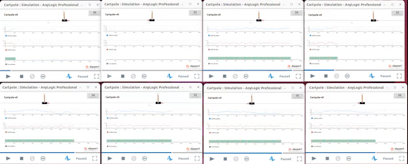
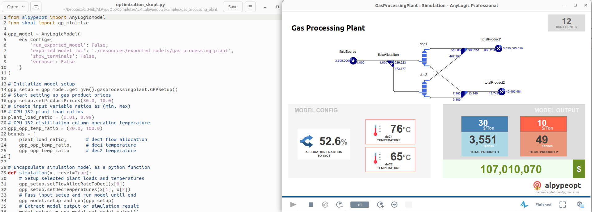

# ALPype

**ALPype** or _AnyLogic Python Pipe_ is an open source library for connecting **AnyLogic** simulation models with python-based **sequential optimization** packages such as `scikit-optimize`, `optuna` , `hyperopt` and `bayesian optmization` AND **reinforcement learning** frameworks that are compatible with _OpenAI Gymnasium_ interface (single agent).

With **ALPype** you will be able to:

* Connect your AnyLogic model to a *sequential optimization* package of your choice (e.g. scikit-optimize ``skopt``).
* Connect your AnyLogic model to a *reinforcement learning* framework of your choice (e.g. ray ``rllib``).
* Scale your RL training by launching many AnyLogic models simultaneously (*requires an exported model*).
* Deploy and evaluate your RL trained policy from AnyLogic.
* Debug your AnyLogic models during optimization loop (*this special feature improves the user experience during model debugging remarkably*).
* Leverage on the AnyLogic rich visualization as the optimization runs (*which ties to the previous bullet point*).

There is a more comprehensive [documentation](https://alpype.readthedocs.io/en/latest/) available that includes numerous examples to help you understand the basic functionalities about its subpackages in greater detail.

## Environments and installation

_ALPype_ includes 2 environments that make the connection between _AnyLogic_ and your _python script_ possible:

* [ALPypeOptConnector](https://alpypeopt.readthedocs.io/en/latest/AnyLogicConnector.html) OR [ALPypeRLConnector](https://alpyperl.readthedocs.io/en/latest/AnyLogicConnector.html) - The AnyLogic connector ('agent') library to be dropped into your simulation model. You can add the [library](https://github.com/MarcEscandell/ALPype/tree/main/bin) to your _Palette_. That will allow you to drag and drop the connector into your model. _Note that further [instructions](https://alpype.readthedocs.io/en/latest/AnyLogicConnector.html) are required to be followed in order for the connector to work_.
* [alpypeopt](https://alpypeopt.readthedocs.io/en/latest/GasProcessingPlant.html) OR [alpyperl](https://alpyperl.readthedocs.io/en/latest/CartPoleV0.html) - The library that you will use after configuring your _optimization solver_ in your python script to connect to the AnyLogic model. To install the base **ALPypeOpt** OR **ALPypeRL** library in python, use `pip install alpypeopt` OR `pip install alpyperl`.

## Bugs and/or development roadmap

At the moment, ALPypeOpt is at its earliest stage. You can join the [alpype project](https://github.com/MarcEscandell/ALPypeRL/discussions) and raise bugs, feature requests or submit code enhancements via pull request.

## Support ALPype's development

If you are financially able to do so and would like to support the development of **ALPype**, please reach out to marcescandellmari@gmail.com.

## License

The ALPypeOpt software suite is licensed under the terms of the Apache License 2.0. See [LICENSE](https://github.com/MarcEscandell/ALPypeRL/blob/main/LICENSE) for more information.

